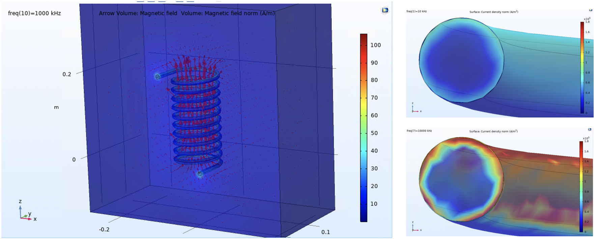

## About Me

Hi I’m Evan Strittmatter

I am an undergraduate student at Yale University in my senior year, majoring in electrical engineering and computer science. My passion for engineering dates back to the moment I got my hands on my first Arduino. I was in fourth grade, with little understanding of how electricity worked, let alone what a programmable microcontroller was. Yet I was immediately captivated and started working with my mom to make a LED light up. I had no concept then of the thousands of hours I would end up spending coding and wiring up increasingly complex creations with this device and others like it. 
During my time at Yale, I Have gained valuable work experience in the areas of robotics, semiconductors and sensors. My goal is to find employment which will allow me to continue to develop my skills in these areas. 

## Resume
<a href="images/Resume.jpg">My Resume</a>

## Projects

### Intelligent Autonomy Lab

For the past three semesters, I have been working in the Intelligent Autonomy Lab at Yale, run by Prof. Ian Abraham.

Humans are great at tactile object identification – for example, you can reach into your pocket and distinguish between your phone, keys, and wallet all without looking. Robots on the other hand struggle to do this. My project is to develop a robotic arm and hand which can identify unknown objects using tactile sense. 

The first step was to set up a control system for the robot and direct it to pick up a known object. A grad student, Chuck Wher, and I developed a PD control algorithm for the robot, enabling the arm to move to desired locations and grasp an object. We modeled this in simulation space using the software Mujoco. Check out the simulations I've done of our controller operating the robot.

 
    <video id="home1" width="290" poster="images/video.jpg" controls="controls autoplay muted" preload="none"> 
        <source type="video/mp4" src="images/RobotHandWave.mp4" /> 
    </video>
    <video id="home2" width="290" poster="images/video.jpg" controls="controls" preload="none"> 
        <source type="video/mp4" src="images/RobotHandGrasp.mp4" /> 
    </video>
    

 

 
  
  
Chuck Wher and I then adapted our controller to a real-life counterpart. With a similar task in mind, we wanted to establish live user control of the robot via a hand held controller. Here is a video demonstrating a basic implementation.
 
 <video id="home1" width="580" poster="images/video.jpg" controls="controls autoplay muted" preload="none"> 
      <source type="video/mp4" src="images/Arm.mp4" /> 
  </video>

The next step was improving the control algorithm, especially for the robotic hand. In order to achieve more complex problem solutions, such as object manipulation (especially for unknown objects), a more complex problem formulation and controller is required. An interesting control problem which demonstrates exact motion and timing is music. Here is a video of the robotic hand, again using Mujoco to model contacts, with the new control algorithm I developed for it, playing the first nine notes of Für Elise.

<video id="home1" width="290" poster="images/video.jpg" controls="controls autoplay muted" preload="none"> 
      <source type="video/mp4" src="images/Allegro_Control_Piano.mp4" /> 
  </video>

Currently, I am working on implementing this new algorithm on a pyhsical system. I also plan to incorporate this with the Robotic arm to reform the combined system.

### Summer Internships at EPC

During the 2022 and 2023 summers, I worked at EPC - a semiconductor company in Los Angeles. 

#### 2023 Summer Internship
I took on two separate projects to help resolve ongoing problems at the company.
##### Trap Spectroscopy Set-up
My first project was developing a spectroscopy set up using monochrometers to perform analysis of the EPC Fet to determine trap density. Trap density is critical information for the Epitaxy team for process control, as well as device modeling. My setup provides them with the ability to determine the impact of specific wavelengths of light on backgate current, i.e. whether the wavelength is trapping or detrapping electrons.  
##### Thermo modeling
My second project was thermo modeling in COMSOL to understand the causes for part failures occuring during Temperature Cycling tests. Here I was able to determine how certain design features impact principle and shear stresses in different substrate layers. 

#### 2022 Summer Internship - LiDAR IC inductance modeling
A major application of their transistor parts is in LiDAR as GaN is especially suited for quick switches between forward and reverse biasing. This makes GaN optimal for LiDAR as it means the LED can be activated in high-frequency short bursts, providing accurate readings in quickly adapting environments. EPC sells complete ICs for this circuit, with the limiting factor on the chips being their inductivity. High inductance resists changes in current, even generating a secondary voltage wave in the chip. My job was to model the inductance in the chip in COMSOL to identify regions in the geometry that contribute strongly to the total inductance of the chip in order to find an optimal design. I developed a modeling procedure and tested it on several different designs to provide the team with insights into promising geometry structures. I also developed a method for testing future iterations of device geometry.  

. 

I can't publish information containing specific part design, but these pictures show models I developed for testing basic properties of a coil. The large picture on the left shows the electric field vectors inside a coil behaving as expected. The two smaller images demonstrate the skin effect - as frequency increases the current crowds closer to the edge of the circular metal conductor.
Applying these same principles to the model allows the user to make intuitive changes to the model to reduce its natural inductance.

    

### Team Robotics Projects
I've always had a passion for team robotics. I made this video for my application to Yale, which shows off some of these projects.

. 
    

### Publications and Talks

<a href="images/micromachines-13-00141.pdf">A Comparative Analysis of Microelectrode Topologies for Electrochemical Oxygen Sensing in Biomedical Applications</a>
Micromachines 2022, 13(1), 141; https://doi.org/10.3390/mi13010141. 

I also presented a talk on this topic at the MRS spring convention 2022. 

<a href="Strittmatter_Evan_Senior_Thesis_Fall_Report.pdf">Senior Thesis: Leveraging Control of a Robotic Hand to Play Für Elise</a>

### Comunities I care about

Beyond my own projects, I also care about my impact on my community. I was inspired to pursue a career in robotics by working with and learning from my parents, mentors, and teachers. Their enthusiasm for creative problem-solving, purveyed through all aspects of science and influenced me in a positive way. Realizing this I have worked with several community groups throughout my life to continue this cycle and keep giving forward. 

#### YOSE
The first of such groups was a volunteer organization founded by one of my good friends in high school. The goal: to inspire excitment for fields of science in underprivileged children in the LA area. Volunteers would lead children on short hikes in the Angeles Crest mountain range, or through the tide pools at beaches, imparting both a passion for nature and facts about the local wildlife in the area.

#### Code Haven
I continued volunteering with the same kind of project at Yale. The Club Code Haven has a similar goal: again working with underprivileged kids, now in the New Haven school system, working to inspire interest in Computer Science. Here we volunteered in a classroom, working with small groups of 3-4 students on a guided project in Scratch of their choosing. My group each created a “Space Invaders” clone where they could blast falling asteroids out of the sky. Every Friday we would meet and work on new aspects of the project, starting first with making a custom character, all the way up to object collisions and iterative code. It was gratifying getting to see the kids playing with their own finished creations by the end of the school year. 

#### South Pasadena Tournament of Roses
Another volunteering community I have enjoyed participating in is the South Pasadena Tournament of Roses. This group centers around constructing the South Pasadena (my hometown) City float. Here I’ve gotten to work on my welding skills as well as getting myself and my brother involved in a community of engineers. I really enjoyed getting to work with my brother on such a large-scale project, watching the float drive through Pasadena at the start of the New Year. Pointing out to my family what parts we had worked on was special.

### Other Passions
Outside of academics I have found fulfillment as president of the Yale men's club soccer team, playing guitar as a member of a band, participating in a variety of outdoor sports and playing board games with my brothers. 

